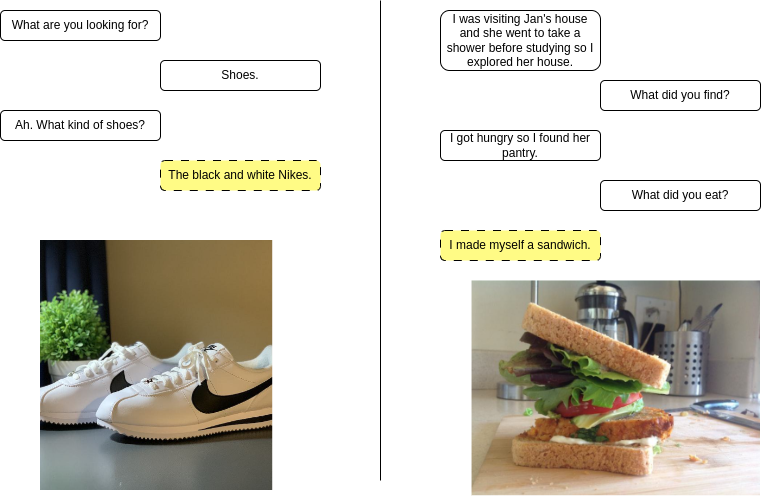

# IMAD
This repo contains code and published data for the AINL2023 paper [IMAD: IMage Augmented multi-modal Dialogue](link.com).

Our dataset serves for task of interpreting image in the context of dialogue. Published code could help with 
1. Classifying if utterance is replaceable with image
2. Finding the best image for utterance
3. Generation of utterance that was replaced with an image

# Data
IMAD Dataset created from mutlitple dialogue dataset sources and Unsplash images. 
Every sample from dataset is 
1. Context of dialogue
2. Image
3. Replaced utterance

